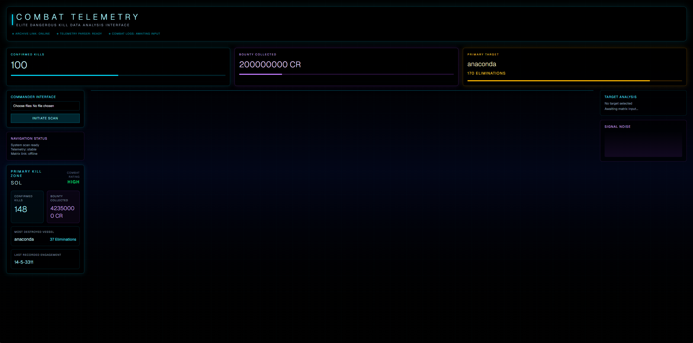
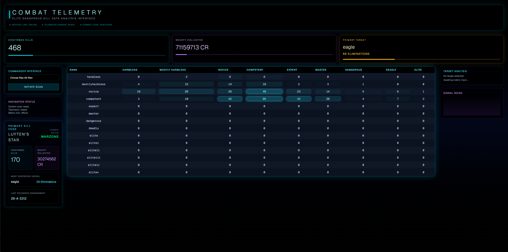
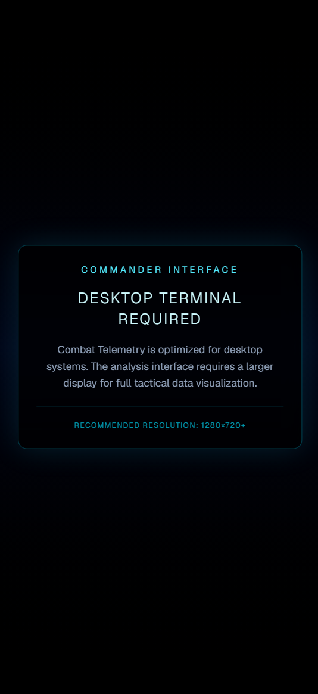
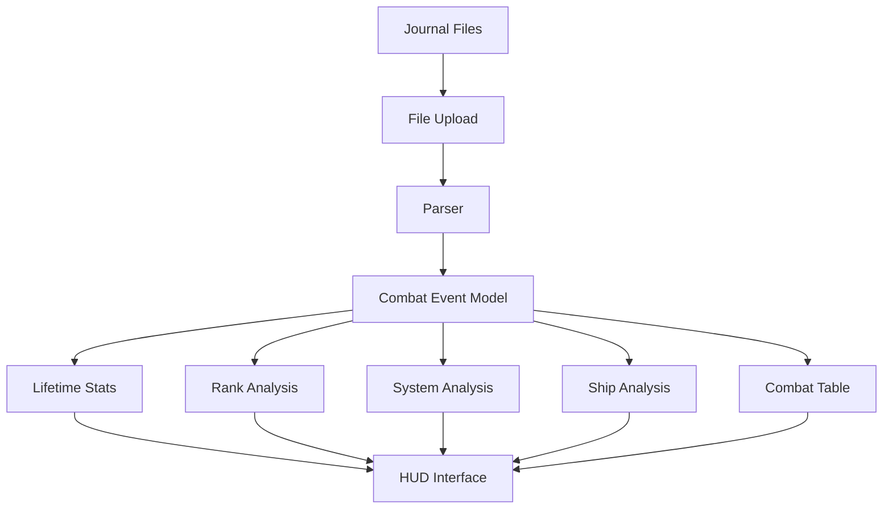

# Combat Telemetry

**_An Elite Dangerous journal analyser_**


Combat Telemetry parses Elite Dangerous journal files to extract combat events, bounty data and engagement statistics through a futuristic HUD-inspired interface.


[Live demo](https://combat-telemetry-elite-dangerous.vercel.app/)

[Repository](https://github.com/Mowhite29/ed-kills.git)

[A sample Elite Dangerous journal file for testing](./docs/sample-journal-file.log)

## Screenshots





## Change Log

[Change Log](./docs/CHANGE_LOG.md)

## Features

### Analysis

- Lifetime combat statistics
- Primary kill zone analysis
- Ship destruction statistics
- Rank breakdowns

### Processing

- Upload multiple journal files
- Automatic combat log parsing
- Client-side processing

### Interface

- Futuristic HUD-inspired design
- Responsive desktop interface

## Why I built this

I built Combat Telemetry for Elite Dangerous to explore file parsing in JavaScript while creating a useful utility for players. The project focuses on transforming raw journal files into meaningful statistics through aggregation and visualisation.

## Technologies

- React
- Next.js
- TypeScript
- Tailwind CSS

## Challenges

One of the main challenges was processing multiple journal files while ensuring combat events were aggregated correctly without introducing duplicate data. Because the journal is event-driven rather than state-driven, related information is spread across several event types and must be correlated before meaningful statistics can be produced.

Another challenge was designing a UI capable of presenting a large amount of combat information without overwhelming the user. I chose a HUD-inspired interface influenced by Elite Dangerous to create a cohesive experience while keeping the data easy to scan.

## Architecture

Combat Telemetry processes locally uploaded Elite Dangerous journal files in the browser. Combat events are parsed into a unified data model before being aggregated into statistics for kills, bounties, systems and rank progression. This allows the application to analyse large journal files while keeping player data entirely local.



## Parsing Strategy

Combat Telemetry builds its statistics by combining information from several different journal events. Rather than treating each event independently, the parser gradually constructs a unified combat model as new events are encountered.

### `FSDJump`

Input:

```json
{
    "event": "FSDJump",
    "StarSystem": "Luyten's Star",
    "timestamp": "2026-05-31T14:18:05Z"
}
```

Produces:

```ts
systems["Luyten's Star"] = {
    kills: 0,
    bounty: 0,
    ships: {},
    lastVisit: '2026-05-31T14:18:05Z',
};
```

### `ShipTargeted`

Input:

```json
{
    "event": "ShipTargeted",
    "PilotName_Localised": "Forbes Manson",
    "PilotRank": "Master",
    "Ship": "python"
}
```

Produces:

```ts
pilots['Forbes Manson'] = {
    rank: 5,
    shipType: 'python',
};
```

### `Bounty`

Input:

```json
{
    "event": "Bounty",
    "PilotName_Localised": "Forbes Manson",
    "Target": "python",
    "TotalReward": 560667
}
```

Updates:

```ts
killRecord[playerRank][5]++;

systems["Luyten's Star"].kills++;
systems["Luyten's Star"].bounty += 560667;
systems["Luyten's Star"].ships['python']++;
```

## AI-Assisted Development

AI was used as a design assistant to iterate on the HUD-inspired interface, explore styling ideas and refine layouts. All application architecture, data modelling, parsing logic and feature implementation were designed and integrated by me.

## Running Locally

```bash
    git clone https://github.com/Mowhite29/ed-kills.git
    cd ed-kills
    pnpm install
    pnpm run dev
```

## Future Improvements

- Search and filtering by system and ship
- CSV/PDF export
- Additional combat analytics to allow users to track which weapons/ships they are most successful with
- Player vs Enemy (PVE) and Player vs Player (PVP) kills differentiation

## What This Project Demonstrates

- Parsing structured log files
- Client-side file handling
- Data modelling
- Data aggregation
- TypeScript
- React state management
- Component-based architecture
- Responsive UI development
- AI-assisted UI iteration

## Key Learnings

Through this project I strengthened my understanding of client-side file handling, data aggregation, and designing interfaces around a specific theme. It also provided experience using AI as a collaborative design tool while maintaining ownership of the application's architecture and implementation.

## License

MIT

## Acknowledgements

Elite Dangerous is developed by Frontier Developments.

This project is an independent fan-made utility and is not affiliated with or endorsed by Frontier Developments.
